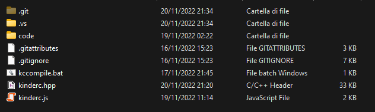
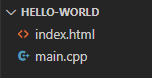
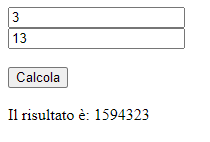
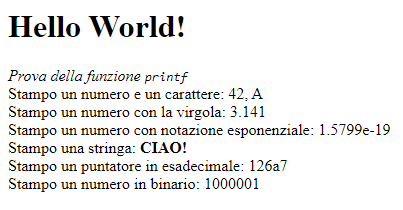
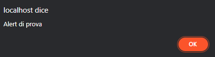
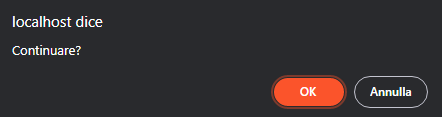
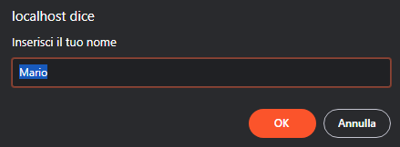

# KinderC
##### *A cura di Niccolò Boano, 2022*

### *Sviluppa moderne e veloci applicazioni Web, utilizzando C++ combinato alla tecnologia WebAssembly.* 

## Indice
1. [Introduzione](#introduzione)
   - [Che cos'è KinderC](#che-cosè-kinderc)
   - [Premesse per il programmatore](#premesse-per-il-programmatore)
2. [Link Utili](#link-utili)
   - [Repository GitHub del progetto](#repository-github-del-progetto)
   - [Compilatore CLANG](#compilatore-clang)
3. [Impostazione dell'ambiente di lavoro](#impostazione-dellambiente-di-lavoro)
4. [Struttura di un'applicazione KinderC](#struttura-di-unapplicazione-kinderc)
5. [Esempi](#esempi)
6. [Hello World](#hello-world)
7. [Strutturazione del file sorgente](#strutturazione-del-file-sorgente)
8. [Tipi di dato](#tipi-di-dato)
   - [Tipi di dato fondamentali](#tipi-di-dato-fondamentali)
   - [Tipi di dato aggiuntivi](#tipi-di-dato-aggiuntivi)
9. [Importazione ed esportazione di metodi](#importazione-ed-esportazione-di-metodi)
   - [Importazione dei metodi (`imported`)](#importazione-dei-metodi-imported)
   - [Esportazione dei metodi (`exported`)](#esportazione-dei-metodi-exported)
10. [Gestione base dell'I/O](#gestione-base-dellio)
      - [La funzione `puts`](#la-funzione-puts)
      - [La funzione `printf`](#la-funzione-printf)
      - [La finestra `alert`](#la-finestra-alert)
      - [La finestra `confirm`](#la-finestra-confirm)
      - [La finestra `prompt`](#la-finestra-prompt)
      - [Esempio di utilizzo delle finestre bloccanti](#esempio-di-utilizzo-delle-finestre-bloccanti)
11. [Gestione della memoria](#gestione-della-memoria)
      - [La memoria in KinderC](#la-memoria-in-kinderc)
      - [Allocazione statica](#allocazione-statica)
      - [Allocazione dinamica](#allocazione-dinamica)
        - [La funzione `malloc`](#la-funzione-malloc)
        - [La funzione `free`](#la-funzione-free)
        - [Gli operatori `new` e `delete` di C++](#gli-operatori-new-e-delete-di-c)
        - [Esempio di utilizzo](#esempio-di-utilizzo-dellallocazione-dinamica)

## Introduzione

### Che cos'è KinderC

KinderC non è altro che una libreria per il linguaggio C++ che permette, attraverso l’utilizzo del compilatore CLANG, di realizzare siti e applicazioni web snelle e performanti. Il codice scritto dal programmatore viene compilato in un file binario in formato wasm, utilizzando la tecnologia WebAssembly, che viene poi incluso in una pagina HTML e mandato in esecuzione al suo caricamento. Presenta alcuni vantaggi rispetto all’utilizzo di JavaScript standard, che qui elenchiamo:
- **Velocità**: Essendo compilata, un’applicazione KinderC tende ad essere più veloce rispetto ad una WebApp scritta in JavaScript standard.
- **Efficienza**: Servendosi di un linguaggio a tipizzazione forte, il programmatore può decidere di allocare variabili grandi quanto meglio crede. Può inoltre allocare la memoria in maniera dinamica.
- **Sicurezza**: Il codice scritto viene compilato in un file WebAssembly binario. Risulta quindi abbastanza complesso andare a decompilarlo per ritornare al codice sorgente, cosa che rappresenta un vantaggio in termini di sicurezza.
- **Semplicità**: Essendo JavaScript un linguaggio C-like, è facile imparare a scrivere codice utilizzando KinderC. Inoltre, tantissimi metodi richiamano le librerie C standard oppure i metodi propri di JavaScript client-side. 

### Premesse per il programmatore

Il programmatore che intende imparare a utilizzare la libreria dovrebbe avere queste conoscenze di base:
- **Conoscenza del linguaggio C/C++ e della sua sintassi**, almeno a livello superficiale.
- **Conoscenza di HTML, CSS, JavaScript**.
Se così non fosse, si consiglia di consultare guide sul linguaggio C (ed eventualmente C++, se si intende programmare a oggetti) prima di proseguire.

## Link Utili

### Repository GitHub del progetto

Questa guida, insieme al file header e alle implementazioni di tutti i metodi della libreria, sono pubblicamente disponibili su GitHub a questo link: https://github.com/nboano/kinderc

### Compilatore CLANG  

Per compilare i nostri codici, ci serviremo del compilatore clang, scaricabile a questo link: https://releases.llvm.org/download.html  
Al fine che tutto funzioni completamente, è necessario che l’eseguibile di clang sia aggiunto al PATH di sistema.

## Impostazione dell'ambiente di lavoro

Per sviluppare utilizzando la libreria è necessario scaricarla dal repo GitHub, il cui link si trova nel paragrafo precedente. Fatto ciò, è necessario anche scaricare e installare il compilatore clang.  

N.B. Si consiglia di clonare il repository in una cartella di facile accesso, specie per semplificare le operazioni di inclusione della libreria e di compilazione da terminale. In tutti gli esempi di questo manuale, il repository sarà stato clonato nella cartella `D:\kinderc`. Si adattino i comandi in relazione a dove si è scelto di collocare il file header e lo script per la compilazione.  

Per scrivere codice è possibile utilizzare un qualsiasi editor di testo. Tuttavia, si raccomanda l’uso di Visual Studio Code, particolarmente leggero e con un’evidenziazione della sintassi ricca e capibile.

Nell’immagine è possibile vedere i file della libreria, che dovrebbero essere presenti sulle vostre macchine prima di iniziare a lavorare.



## Struttura di un'applicazione KinderC

La WebApp di compone fondamentalmente di tre parti:
- **UN FILE HTML**, di solito nominato `index.html`, che contiene la struttura della pagina, e che nel tag head presenta un riferimento agli altri file.
- **UNO SCRIPT `kinderc.js`**, soprannominato "glue code". Esso si trova nella libreria da voi scaricata e ha il compito di mettere in comunicazione l’interprete JavaScript, e quindi il DOM stesso, con il compilato da voi scritto.
La cosa più comoda per includere il kinderc.js è utilizzare la CDN:
**https://cdn.jsdelivr.net/gh/nboano/kinderc/kinderc.js**  
- **UN FILE SORGENTE `main.cpp`**, che verrà compilato in un file binario `main.wasm`, che contiene effettivamente il codice.

## Esempi

Tutti gli esempi che vi vengono presentati sono contenuti nella cartella `examples\` del repo.

## Hello World

Cominciamo quindi con un primo esempio, un classico Hello World.  
Creiamo una cartella sul nostro computer a cui possiamo accedere da browser, utilizzando un WebServer a nostra scelta.  

**N.B.** È importante aprire le applicazioni passando da un WebServer e non semplicemente cliccando sul file index.html, in quanto il browser non permette di richiedere il file wasm quando aperto così.

All’interno della cartella, creiamo un nuovo file `index.html`, insieme ad un file `main.cpp`.

&nbsp;&nbsp;&nbsp;*Ecco i file che devono essere presenti nella nostra cartella.*

#### **`index.html`** [Visualizza](examples/01-hello-world/index.html)

```html
<!DOCTYPE html>
<html lang="en">
<head>
    <meta charset="UTF-8">
    <meta name="viewport" content="width=device-width, initial-scale=1.0">
    <title>KinderC Hello World</title>

    <script src="https://cdn.jsdelivr.net/gh/nboano/kinderc/kinderc.js"></script>
    <assembly src="main.wasm"></assembly>
</head>
<body>
    
</body>
</html>
```
> *Nel file HTML devono essere specificati il percorso del futuro file wasm compilato, e anche quello del file kinderc.js, come da esempio.*  

Creiamo quindi anche il file sorgente, `main.cpp`, su cui andremo a codificare il nostro primo esempio.

#### **`main.cpp`** [Visualizza](examples/01-hello-world/main.cpp)
```cpp
#include "D:\kinderc\kinderc.hpp"

int main() {
    	printf("<h1>Hello World!</h1>");
}
```

> *Nel file sorgente C++ includiamo la libreria precedentemente scaricata, e nel main scriviamo il nostro codice.*  

Ora è il momento di compilare. Apriamo un terminale (anche quello interno di VSCode), e spostiamoci nella cartella del progetto. Lanciamo il seguente comando:

```bat
D:\kinderc\kccompile main.cpp main.wasm
```

Ovviamente il comando va adattato a seconda di dove avete deciso di collocare il file `kccompile`.  
Se non ci sono errori, il tutto dovrebbe funzionare.


## Strutturazione del file sorgente

Il file sorgente, ovvero quello che viene compilato da terminale, deve includere obbligatoriamente la libreria all’inizio per poter funzionare. È possibile includere file e librerie esterne, come in un ambiente C standard, utilizzando una `#include`.  
Apppena l’albero DOM viene caricato in memoria (cioè, appena la pagina viene caricata) il metodo `int main()` viene mandato in esecuzione. Proprio come in un’applicazione console, quindi, è necessario inserire tutto il codice che vogliamo venga eseguito all’interno del metodo principale.

## Tipi di dato

Come in ogni linguaggio a tipizzazione forte, anche in C e C++ abbiamo una serie di tipi dato diversi. Oltre ai tipi dato di sistema, utilizzando KinderC ne vengono aggiunti altri due.

### Tipi di dato fondamentali

| Nome del tipo | Dimensione (Byte) | Descrizione                        | Flag |
|---------------|-------------------|------------------------------------|------|
| `char`        | 1                 | Rappresenta un carattere ASCII.    | %c   |
| `bool`        | 1                 | Rappresenta un valore booleano.    | -    |
| `wchar_t`     | 2                 | Rappresenta un carattere Unicode.  | -    |
| `short`       | 2                 | Rappresenta un intero su 16bit.    | %i   |
| `int`         | 4                 | Rappresenta un intero su 32bit.    | %i   |
| `long`        | 8                 | Rappresenta un intero su 64bit.    | %i   |
| `float`       | 4                 | Rappresenta un decimale su 32bit.  | %f   |
| `double`      | 8                 | Rappresenta un decimale su 64bit.  | %f   |

### Tipi di dato aggiuntivi

| Nome del tipo | Dimensione (Byte) | Descrizione                                    |
|---------------|-------------------|------------------------------------------------|
| `string`      | 4 + n.di caratteri| Rappresenta una serie di char allocata in heap.|
| `object`      | 8                 | Punta a un qualunque oggetto JavaScript.       |

Generalmente, quando dichiariamo una variabile, è necessario specificare il suo tipo.

```cpp
int n = 15;
const double PI = 3.14159;
```

Tuttavia, a seconda delle nostre preferenze, è anche possibile ometterlo, lasciando tipizzare il sistema. 

Le due scritture presentate sotto sono assolutamente equivalenti. Lo standard C++ prevede l'utilizzo di `auto`, ma includendo KinderC è anche possibile utilizzare `var`.

```cpp
var mStr = "Ciao a tutti";
auto str2 = "Seconda stringa";
```

## Importazione ed esportazione di metodi

Le due macro che vi vengono illustrate (`imported` ed `exported`), se scritte prima del prototipo di una funzione qualsiasi, permettono ad essa di essere esportata oppure importata dall'ambiente JavaScript.

### Importazione dei metodi (`imported`)

Utilizzando la parola chiave `imported` è possibile rendere accessibile un qualsiasi metodo JavaScript dal nostro programma C++.

Segue un esempio dove viene importato un metodo che ritorna il timestamp UNIX corrente.

#### **`index.html`** [Visualizza](examples/02-imported/index.html)
```html
<!DOCTYPE html>
<html lang="en">
<head>
    <meta charset="UTF-8">
    <meta name="viewport" content="width=device-width, initial-scale=1.0">
    <title>KinderC - Importing functions</title>

    <script src="https://cdn.jsdelivr.net/gh/nboano/kinderc/kinderc.js"></script>
    <assembly src="main.wasm"></assembly>

    <script>
        env.ottieniTempo = function() {
            return Date.now() / 1000;
        }
    </script>
</head>
<body>
```
> Per scrivere una funzione JavaScript che sia visibile dal programma compilato, è necessario farla figliare all'oggetto `env`. In caso contrario, un errore verrà generato.

#### **`main.cpp`** [Visualizza](examples/02-imported/main.cpp)
```cpp
#include "D:\kinderc\kinderc.hpp"

imported unsigned long ottieniTempo();

int main() {
    printf("Secondi passati dal 1 GEN 1970: %i", ottieniTempo());
}
```

> Nell'esempio, la funzione importata viene richiamata, e il suo risultato stampato a schermo.


**N.B.** Con una `imported` è possibile importare solo funzioni che hanno parametri numerici e che restituiscono valori numerici. Non è possibile passare direttamente le stringhe a una funzione JS, in quanto la stringa, in un linguaggio come il C++, è un puntatore.

### Esportazione dei metodi (`exported`)

Al contrario, la macro `exported` rende una funzione o una procedura del compilato globalmente accessibile dalla pagina. 

Di seguito viene riportato lo snippet di una funzione che calcola il valore della potenza dati base ed esponente e lo scrive in un elemento del DOM.

#### **`index.html`** [Visualizza](examples/03-exported/index.html)
```html
<!DOCTYPE html>
<html lang="en">
<head>
    <meta charset="UTF-8">
    <meta name="viewport" content="width=device-width, initial-scale=1.0">
    <title>KinderC - Exporting functions</title>

    <script src="https://cdn.jsdelivr.net/gh/nboano/kinderc/kinderc.js"></script>
    <assembly src="main.wasm"></assembly>

</head>
<body>
    <input type="number" placeholder="Base" id="txtBase">
    <br>
    <input type="number" placeholder="Esponente" id="txtEsponente">
    <br><br>
    <button onclick="esponenziale(document.querySelector('#txtBase').valueAsNumber, document.querySelector('#txtEsponente').valueAsNumber)">Calcola</button>
    <br><br>
    Il risultato &egrave;: <b id="lblRisultato"></b>
</body>
</html>
```

#### **`main.cpp`** [Visualizza](examples/03-exported/main.cpp)

```cpp
#include "D:\kinderc\kinderc.hpp"

exported void esponenziale(int base, int esponente) {
    long risultato = base;
    for (int i = 0; i < esponente - 1; i++) risultato *= base;

    $("#lblRisultato").innerText = String::Format("%i", risultato);
}

int main() {}
```



## Gestione base dell'I/O

### La funzione `puts`

Analogamente alla funzione presente in C ANSI, `puts` stampa a video la stringa passata come parametro. Nell'implementazione della libreria KinderC, la stringa viene aggiunta in coda alla pagina.

```cpp
puts("<h1>Hello World!</h1>");
```

### La funzione `printf`

La `printf`, analogamente alla funzione presente in C ANSI, permette di scrivere una stringa, formattata a piacere, in output.  
Nel caso di un'applicazione KinderC, la stringa viene stampata in coda alla pagina. Vi è un limite di 8192 caratteri per le chiamate `printf`. Se si desidera stampare a video stringhe più lunghe, utilizzare [`puts`](#la-funzione-puts).

&Egrave; possibile utilizzare numerosi flag per stampare variabili di diverso tipo, che sono qui elencati.

|Flag|Descrizione                                                               |
|----|--------------------------------------------------------------------------|
|`%c`|Stampa a video un carattere.                                              |
|`%s`|Stampa un'array di caratteri. Per stampare una stringa, castare a `char*`.|
|`%i`|Stampa un intero a 32bit con segno.                                       |
|`%d`|Uguale a `%i`.                                                            |
|`%x`|Stampa un numero intero in notazione esadecimale.                         |
|`%b`|Stampa un numero intero in notazione binaria.                             |
|`%f`|Stampa un numero a virgola mobile.                                        |
|`%e`|Stampa un numero a virgola mobile, in notazione esponenziale.             |

Di seguito un esempio di utilizzo della funzione `printf`:

#### **`main.cpp`** [Visualizza](examples/04-printf/main.cpp)

```cpp
#include "D:\kinderc\kinderc.hpp"

int main() {
    string s = "CIAO!";
    printf("<h1>Hello World!</h1>");
    printf("<i>Prova della funzione <code>printf</code></i><br>");
    printf("Stampo un numero e un carattere: %i, %c <br>", 42, 'A');
    printf("Stampo un numero con la virgola: %f<br>", 3.1415);
    printf("Stampo un numero con notazione esponenziale: %e<br>", 1.58e-19);
    printf("Stampo una stringa: <b>%s</b><br>", (char*)s);
    printf("Stampo un puntatore in esadecimale: %x<br>", (char*)s);
    printf("Stampo un numero in binario: %b<br>", 65);
}
```



### La finestra `alert`

Analogamente alla funzione JavaScript `alert`, la procedura KinderC `alert` visualizza una finestra di dialogo (il cui aspetto cambia a seconda del browser) con un testo a nostra scelta, passato come primo parametro e un pulsante OK.  
**N.B.** La funzione ritorna solo quando l'utente ha premuto sul tasto. Il main thread, fino a quel momento, è completamente bloccato.

```cpp
alert("Alert di prova.");
```



### La finestra `confirm`

La finestra `confirm` è simile a un'[`alert`](#la-finestra-alert), ma al contrario di questa presenta due bottoni (di solito OK e Annulla). Se l'utente clicca OK, viene ritornato `true`, in caso contrario, viene ritornato `false`.

```cpp
bool result = confirm("Continuare?");
```



### La finestra `prompt`

La finestra `prompt` permette all'utente di scrivere un testo. Come primo parametro, nella chiamata di funzione, passiamo il testo della finestra. Il secondo parametro, opzionale, è il valore di default della casella di testo dove l'utente andrà a scrivere. Se non specificato, la casella sarà vuota.  
Il testo scritto dall'utente viene ritornato. Se l'utente ha cliccato su Annulla, viene ritornata una stringa vuota (`"\0"`).

```cpp
char* risposta = prompt("Inserisci il tuo nome", "Mario");
```



### Esempio di utilizzo delle finestre bloccanti

#### **`index.html`** [Visualizza](examples/05-blocking-windows/index.html)
```html
<!DOCTYPE html>
<html lang="en">
<head>
    <meta charset="UTF-8">
    <meta http-equiv="X-UA-Compatible" content="IE=edge">
    <meta name="viewport" content="width=device-width, initial-scale=1.0">
    <title>KinderC - Finestre bloccanti</title>

    <script src="https://cdn.jsdelivr.net/gh/nboano/kinderc/kinderc.js"></script>
    <assembly src="main.wasm"></assembly>
</head>
<body>
    <button onclick="showAlert()">Mostra un'alert</button>
    <br><br>
    <button onclick="askPermission()">Mostra una confirm</button> Hai risposto: <span id="lblPermesso"></span>
    <br><br>
    <button onclick="askName()">Mostra un prompt</button> Hai risposto: <span id="lblNome"></span>
</body>
</html>
```

#### **`main.cpp`** [Visualizza](examples/05-blocking-windows/main.cpp)
```cpp
#include "D:\kinderc\kinderc.hpp"

int main() {}

exported void showAlert() {
    alert("Alert di prova");
}
exported void askPermission() {
    bool perm = confirm("Confermi?");
    $("#lblPermesso").innerText = perm ? "SI" : "NO";
}
exported void askName() {
    char* name = prompt("Inserisci il tuo nome...");
    $("#lblNome").innerText = name;
}
```


## Gestione della memoria

Sicuramente uno dei vantaggi dell'utilizzo di questa libreria è la possibilità per il programmatore di allocare la memoria come meglio crede. Vediamo come.

### La memoria in KinderC

Basandosi su WebAssembly, KinderC ne eredita lo schema di memoria.  
Al caricamento della pagina un'area virtuale di memoria dalla dimensione di 131072 byte (128 kB) viene allocata. Al suo interno saranno memorizzate e allocate (in maniera statica, cioè al caricamento del binario in memoria) tutte le variabili, locali e globali, insieme agli array allocati staticamente (vedi [Allocazione statica](#allocazione-statica)). Quest'area di memoria costituisce il cosiddetto **stack**, che ha una dimensione limitata.

Se sono necessarie quantità di memoria più grandi, esse vanno richieste esplicitamente a runtime, utilizzando le funzioni di [allocazione dinamica](#allocazione-dinamica). Allocando dinamicamente la memoria, viene riservato spazio nella cosiddetta **heap**, area di memoria successiva allo stack, dove si può accedere esclusivamente con puntatori. La creazione e la distruzione di blocchi di memoria heap avviene su richiesta del programmatore e dinamicamente, cioè a runtime.

> Alcuni tipi dato, come ad esempio `string`, utilizzano l'allocazione dinamica in maniera implicita. Un'istanza di stringa, pur parendo una normale variabile statica, in realtà contiene al suo interno un puntatore alla heap (il `CharArray`) dove la stringa è effettivamente allocata.

### Allocazione statica

Tutte le variabili sono allocate staticamente dal sistema, in una zona di memoria chiamata *stack*. Le variabili globali vengono allocate al caricamento del programma, e saranno deallocate solo alla chiusura della pagina. Lo stesso discorso vale per le variabili dichiarate `static`.

Le variabili locali, invece, vengono allocate al momento della loro dichiarazione e deallocate alla fine del metodo che le contiene.

Infine anche gli array sono allocati nello stack. Per questo motivo la loro dimensione deve essere decisa a priori e non può essere cambiata.

```cpp
int n = 0x16; // Sono allocati nello stack 4 byte.
int vett[50] = {-16, 0, 8, 65, -10e2, -4, ...}; // Sono allocati nello stack 4*50 byte.
char str[] = "CIAO"; // Sono allocati nello stack 5 byte (4 char + \0)
```

### Allocazione dinamica

Come già specificato prima, è possibile e spesso necessaro allocare dinamicamente la memoria. KinderC offre due funzioni in particolare adatte a questo scopo: `malloc` e `free`, già presenti nelle librerie ANSI C standard. Il loro funzionamento è identico a queste ultime.

#### La funzione `malloc`

La `malloc` alloca N byte all'interno dell'*heap* e restituisce il puntatore all'area allocata. Nel caso in cui la memoria richiesta non bastasse, verrà richiesto automaticamente browser di espanderla di 65536 byte alla volta.

**N.B.** Il puntatore restituito è un puntatore generico (`void*`). Per assegnarlo a un puntatore di altro tipo, è necessario un cast esplicito.

```cpp
int* arrayptr = (int*)malloc(5 * sizeof(int)); // Riservo posto per 5 interi.

arrayptr[0] = 15;
*(arrayptr + 1) = -130;
```

#### La funzione `free` 

Una volta che la memoria allocata dinamicamente non è più necessaria, è buona norma liberarla. A tal scopo, esiste la funzione `free`, che, passato un puntatore in input, libera la zona di memoria a esso associata.

```cpp
free(arrayptr);
```

#### Gli operatori `new` e `delete` di C++

Vi sono due operatori appositi in C++ che svolgono le stesse operazioni di `malloc` e `free`, cioè `new` e `delete`.

- `new` alloca un oggetto in heap.
    ```cpp
    auto el = new HTMLElement(...);
    ```
- `delete` elimina un oggetto allocato con `new`.
    ```cpp
    delete el;
    ```
- `new[]` alloca dinamicamente un array di un certo tipo, data una dimensione.
    ```cpp
    int* arrayptr = new int[5];
    ```
- `delete[]` elimina un array allocato con `new[]`.
    ```cpp
    delete[] arrayptr;
    ```

### Esempio di utilizzo dell'allocazione dinamica

#### **`index.html`** [Visualizza](examples/06-malloc-new/index.html)
```html
<!DOCTYPE html>
<html lang="en">
<head>
    <meta charset="UTF-8">
    <meta http-equiv="X-UA-Compatible" content="IE=edge">
    <meta name="viewport" content="width=device-width, initial-scale=1.0">
    <title>KinderC - Malloc</title>

    <script src="https://cdn.jsdelivr.net/gh/nboano/kinderc/kinderc.js"></script>
    <assembly src="main.wasm"></assembly>
</head>
<body>
    <button onclick="allocate_and_print(10);">Alloca 10 elementi</button>
    <button onclick="allocate_and_print(50);">Alloca 50 elementi</button>
    <button onclick="allocate_and_print(100);">Alloca 100 elementi</button>
    <div id="results"></div>
</body>
</html>
```

#### **`main.cpp`** [Visualizza](examples/06-malloc-new/main.cpp)
```cpp
#include "D:\kinderc\kinderc.hpp"

exported void allocate_and_print(int n) {
    int* array = new int[n];
    // Same as int* array = (int*)malloc(n*sizeof(int));

    $("#results").innerHTML = "";
    string rs = "";

    for (int i = 0; i < n; i++)
    {
        array[i] = i + 1;
        rs += (char*)string::Format("<b>array[%i]</b>: %i<br>", i, array[i]);
    } 

    $("#results").innerHTML = rs;

    delete[] array;
    // Same as free(array);
}

int main() {}
```