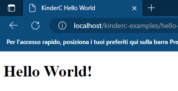

# KinderC
##### *By Niccolò Boano, 2022-24*

### *Develop modern and fast Web Applications using C++, combined with the WebAssembly technology.*

## Get started!

First, install the ```clang```/```llvm``` compiler:

```bash
sudo apt-get install llvm
```

(*If you are using Windows, go [there](https://releases.llvm.org/download.html).*)

Then, clone this repository:
```bash
git clone https://github.com/nboano/kinderc.git
```

Create a new C++ file, for example ```main.cpp```:

```cpp
#include "/path/to/kinderc.hpp"

int main() {
    printf("<h1>Hello World!</h1>");
}
```

Compile it into a new ```wasm``` file:
```bash
clang --target=wasm32 -std=c++17 -Wl,--no-entry -Wl,--export-dynamic -Wl,--allow-undefined -Wl,--lto-O3 -Wl,--import-memory -O3 -s -flto -nostdlib -fdeclspec -o main.wasm main.cpp
```

Create a new HTML file, that will be your webpage:
```html
<!DOCTYPE html>
<html lang="en">
<head>
    <meta charset="UTF-8">
    <meta name="viewport" content="width=device-width, initial-scale=1.0">
    <title>KinderC Hello World</title>

    <script src="https://cdn.jsdelivr.net/gh/nboano/kinderc/kinderc.js"></script>
    <assembly src="main.wasm"></assembly>
</head>
<body>
    
</body>
</html>
```

Open your webpage (that should be hosted on an HTTP server):


**That's it!**

## Documentation

[](guides/it)
[](guides/en)