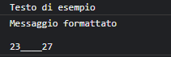

## La classe `Console`

Utilizzando la classe `Console` è possibile scrivere variabili di ogni tipo all'interno della console per sviluppatori del browser.

### `Console::Write`

Il metodo `Console::Write` permette di scrivere in console una stringa qualsiasi, e, utilizzando gli stessi flag della [`printf`](io-management.md#la-funzione-printf), anche altre variabili.

```cpp
Console::Write("Testo di esempio");
Console::Write("Messaggio formattato\n\n%i____%i", 23, 27);
```

