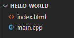

## Hello World

Cominciamo quindi con un primo esempio, un classico Hello World.  
Creiamo una cartella sul nostro computer a cui possiamo accedere da browser, utilizzando un WebServer a nostra scelta.  

**N.B.** È importante aprire le applicazioni passando da un WebServer e non semplicemente cliccando sul file index.html, in quanto il browser non permette di richiedere il file wasm quando aperto così.

All’interno della cartella, creiamo un nuovo file `index.html`, insieme ad un file `main.cpp`.

&nbsp;&nbsp;&nbsp;*Ecco i file che devono essere presenti nella nostra cartella.*

#### **`index.html`** [Visualizza](../../examples/01-hello-world/index.html)

```html
<!DOCTYPE html>
<html lang="en">
<head>
    <meta charset="UTF-8">
    <meta name="viewport" content="width=device-width, initial-scale=1.0">
    <title>KinderC Hello World</title>

    <script src="https://cdn.jsdelivr.net/gh/nboano/kinderc/kinderc.js"></script>
    <assembly src="main.wasm"></assembly>
</head>
<body>
    
</body>
</html>
```
> *Nel file HTML devono essere specificati il percorso del futuro file wasm compilato, e anche quello del file kinderc.js, come da esempio.*  

Creiamo quindi anche il file sorgente, `main.cpp`, su cui andremo a codificare il nostro primo esempio.

#### **`main.cpp`** [Visualizza](../../examples/01-hello-world/main.cpp)
```cpp
#include "../../kinderc.hpp"

int main() {
    	printf("<h1>Hello World!</h1>");
}
```

> *Nel file sorgente C++ includiamo la libreria precedentemente scaricata, e nel main scriviamo il nostro codice.*  

Ora è il momento di compilare. Apriamo un terminale (anche quello interno di VSCode), e spostiamoci nella cartella del progetto. Lanciamo il seguente comando:

```bat
D:\kinderc\kccompile main.cpp main.wasm
```

Ovviamente il comando va adattato a seconda di dove avete deciso di collocare il file `kccompile`.  
Se non ci sono errori, il tutto dovrebbe funzionare.

