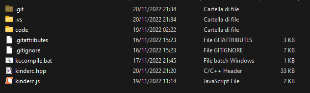

## Introduzione

### Che cos'è KinderC

KinderC non è altro che una libreria per il linguaggio C++ che permette, attraverso l’utilizzo del compilatore CLANG, di realizzare siti e applicazioni web snelle e performanti. Il codice scritto dal programmatore viene compilato in un file binario in formato wasm, utilizzando la tecnologia WebAssembly, che viene poi incluso in una pagina HTML e mandato in esecuzione al suo caricamento. Presenta alcuni vantaggi rispetto all’utilizzo di JavaScript standard, che qui elenchiamo:
- **Velocità**: Essendo compilata, un’applicazione KinderC tende ad essere più veloce rispetto ad una WebApp scritta in JavaScript standard.
- **Efficienza**: Servendosi di un linguaggio a tipizzazione forte, il programmatore può decidere di allocare variabili grandi quanto meglio crede. Può inoltre allocare la memoria in maniera dinamica.
- **Sicurezza**: Il codice scritto viene compilato in un file WebAssembly binario. Risulta quindi abbastanza complesso andare a decompilarlo per ritornare al codice sorgente, cosa che rappresenta un vantaggio in termini di sicurezza.
- **Semplicità**: Essendo JavaScript un linguaggio C-like, è facile imparare a scrivere codice utilizzando KinderC. Inoltre, tantissimi metodi richiamano le librerie C standard oppure i metodi propri di JavaScript client-side. 

### Premesse per il programmatore

Il programmatore che intende imparare a utilizzare la libreria dovrebbe avere queste conoscenze di base:
- **Conoscenza del linguaggio C/C++ e della sua sintassi**, almeno a livello superficiale.
- **Conoscenza di HTML, CSS, JavaScript**.
Se così non fosse, si consiglia di consultare guide sul linguaggio C (ed eventualmente C++, se si intende programmare a oggetti) prima di proseguire.

## Link Utili

### Repository GitHub del progetto

Questa guida, insieme al file header e alle implementazioni di tutti i metodi della libreria, sono pubblicamente disponibili su GitHub a questo link: https://github.com/nboano/kinderc

### Compilatore CLANG  

Per compilare i nostri codici, ci serviremo del compilatore clang, scaricabile a questo link: https://releases.llvm.org/download.html  
Al fine che tutto funzioni completamente, è necessario che l’eseguibile di clang sia aggiunto al PATH di sistema.

## Impostazione dell'ambiente di lavoro

Per sviluppare utilizzando la libreria è necessario scaricarla dal repo GitHub, il cui link si trova nel paragrafo precedente. Fatto ciò, è necessario anche scaricare e installare il compilatore clang.  

N.B. Si consiglia di clonare il repository in una cartella di facile accesso, specie per semplificare le operazioni di inclusione della libreria e di compilazione da terminale. In tutti gli esempi di questo manuale, il repository sarà stato clonato nella cartella `D:\kinderc`. Si adattino i comandi in relazione a dove si è scelto di collocare il file header e lo script per la compilazione.  

Per scrivere codice è possibile utilizzare un qualsiasi editor di testo. Tuttavia, si raccomanda l’uso di Visual Studio Code, particolarmente leggero e con un’evidenziazione della sintassi ricca e capibile.

Nell’immagine è possibile vedere i file della libreria, che dovrebbero essere presenti sulle vostre macchine prima di iniziare a lavorare.



## Struttura di un'applicazione KinderC

La WebApp di compone fondamentalmente di tre parti:
- **UN FILE HTML**, di solito nominato `index.html`, che contiene la struttura della pagina, e che nel tag head presenta un riferimento agli altri file.
- **UNO SCRIPT `kinderc.js`**, soprannominato "glue code". Esso si trova nella libreria da voi scaricata e ha il compito di mettere in comunicazione l’interprete JavaScript, e quindi il DOM stesso, con il compilato da voi scritto.
La cosa più comoda per includere il kinderc.js è utilizzare la CDN:
**https://cdn.jsdelivr.net/gh/nboano/kinderc/kinderc.js**  
- **UN FILE SORGENTE `main.cpp`**, che verrà compilato in un file binario `main.wasm`, che contiene effettivamente il codice.

## Esempi

Tutti gli esempi che vi vengono presentati sono contenuti nella cartella `examples\` del repo.

## Compilazione

Per i sistemi Windows, è possibile compilare facilmente il proprio file `.cpp` eseguendo lo script `kccompile` (che si trova nella root del repository).

```bat
kccompile main.cpp main.wasm
```

Per i sistemi UNIX, è necessario utilizzare il comando completo, richiamando il compilatore `clang`.

```bash
clang --target=wasm32 -std=c++17 -Wl,--no-entry -Wl,--export-dynamic -Wl,--allow-undefined -Wl,--lto-O3 -Wl,--import-memory -O3 -s -flto -nostdlib -fdeclspec -o main.wasm main.cpp
```