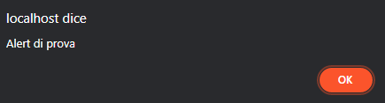
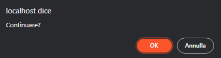

## Gestione base dell'I/O

### La funzione `puts`

Analogamente alla funzione presente in C ANSI, `puts` stampa a video la stringa passata come parametro. Nell'implementazione della libreria KinderC, la stringa viene aggiunta in coda alla pagina.

```cpp
puts("<h1>Hello World!</h1>");
```

### La funzione `printf`

La `printf`, analogamente alla funzione presente in C ANSI, permette di scrivere una stringa, formattata a piacere, in output.  
Nel caso di un'applicazione KinderC, la stringa viene stampata in coda alla pagina. Vi è un limite di 8192 caratteri per le chiamate `printf`. Se si desidera stampare a video stringhe più lunghe, utilizzare [`puts`](#la-funzione-puts).

&Egrave; possibile utilizzare numerosi flag per stampare variabili di diverso tipo, che sono qui elencati.

|Flag|Descrizione                                                               |
|----|--------------------------------------------------------------------------|
|`%c`|Stampa a video un carattere.                                              |
|`%s`|Stampa un'array di caratteri. Per stampare una stringa, castare a `char*`.|
|`%i`|Stampa un intero a 32bit con segno.                                       |
|`%d`|Uguale a `%i`.                                                            |
|`%x`|Stampa un numero intero in notazione esadecimale.                         |
|`%b`|Stampa un numero intero in notazione binaria.                             |
|`%f`|Stampa un numero a virgola mobile.                                        |
|`%e`|Stampa un numero a virgola mobile, in notazione esponenziale.             |

Di seguito un esempio di utilizzo della funzione `printf`:

#### **`index.html`** [Visualizza](../../examples/04-printf/index.html) *(Il file è stato omesso in quanto senza un body)*

#### **`main.cpp`** [Visualizza](../../examples/04-printf/main.cpp)

```cpp
#include "../../kinderc.hpp"

int main() {
    string s = "CIAO!";
    printf("<h1>Hello World!</h1>");
    printf("<i>Prova della funzione <code>printf</code></i><br>");
    printf("Stampo un numero e un carattere: %i, %c <br>", 42, 'A');
    printf("Stampo un numero con la virgola: %f<br>", 3.1415);
    printf("Stampo un numero con notazione esponenziale: %e<br>", 1.58e-19);
    printf("Stampo una stringa: <b>%s</b><br>", (char*)s);
    printf("Stampo un puntatore in esadecimale: %x<br>", (char*)s);
    printf("Stampo un numero in binario: %b<br>", 65);
}
```


### La finestra `alert`

Analogamente alla funzione JavaScript `alert`, la procedura KinderC `alert` visualizza una finestra di dialogo (il cui aspetto cambia a seconda del browser) con un testo a nostra scelta, passato come primo parametro e un pulsante OK.  
**N.B.** La funzione ritorna solo quando l'utente ha premuto sul tasto. Il main thread, fino a quel momento, è completamente bloccato.

```cpp
alert("Alert di prova.");
```



### La finestra `confirm`

La finestra `confirm` è simile a un'[`alert`](#la-finestra-alert), ma al contrario di questa presenta due bottoni (di solito OK e Annulla). Se l'utente clicca OK, viene ritornato `true`, in caso contrario, viene ritornato `false`.

```cpp
bool result = confirm("Continuare?");
```



### La finestra `prompt`

La finestra `prompt` permette all'utente di scrivere un testo. Come primo parametro, nella chiamata di funzione, passiamo il testo della finestra. Il secondo parametro, opzionale, è il valore di default della casella di testo dove l'utente andrà a scrivere. Se non specificato, la casella sarà vuota.  
Il testo scritto dall'utente viene ritornato. Se l'utente ha cliccato su Annulla, viene ritornata una stringa vuota (`"\0"`).

```cpp
char* risposta = prompt("Inserisci il tuo nome", "Mario");
```


### Esempio di utilizzo delle finestre bloccanti

#### **`index.html`** [Visualizza](../../examples/05-blocking-windows/index.html)
```html
<!DOCTYPE html>
<html lang="en">
<head>
    <meta charset="UTF-8">
    <meta http-equiv="X-UA-Compatible" content="IE=edge">
    <meta name="viewport" content="width=device-width, initial-scale=1.0">
    <title>KinderC - Finestre bloccanti</title>

    <script src="https://cdn.jsdelivr.net/gh/nboano/kinderc/kinderc.js"></script>
    <assembly src="main.wasm"></assembly>
</head>
<body>
    <button onclick="showAlert()">Mostra un'alert</button>
    <br><br>
    <button onclick="askPermission()">Mostra una confirm</button> Hai risposto: <span id="lblPermesso"></span>
    <br><br>
    <button onclick="askName()">Mostra un prompt</button> Hai risposto: <span id="lblNome"></span>
</body>
</html>
```

#### **`main.cpp`** [Visualizza](../../examples/05-blocking-windows/main.cpp)
```cpp
#include "../../kinderc.hpp"

int main() {}

exported void showAlert() {
    alert("Alert di prova");
}
exported void askPermission() {
    bool perm = confirm("Confermi?");
    $("#lblPermesso").innerText = perm ? "SI" : "NO";
}
exported void askName() {
    char* name = prompt("Inserisci il tuo nome...");
    $("#lblNome").innerText = name;
}
```